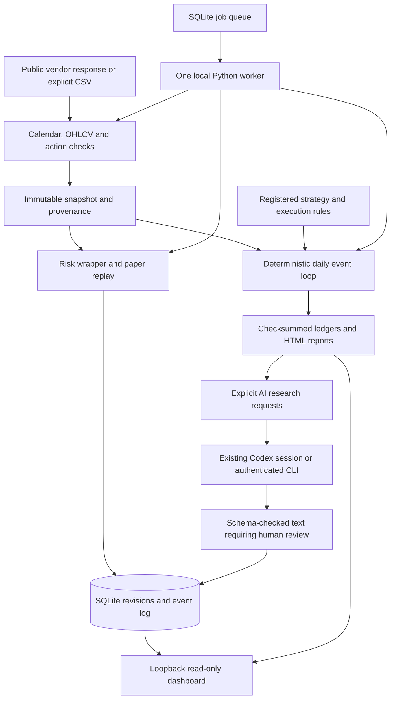

# Architecture and learning map

Research Desk is a local research prototype. The event loop and ledger own numbers;
AI produces reviewable text. No component can submit a brokerage order.

## Components and contracts

| Component | Responsibility | Communication |
|---|---|---|
| `data`, `market_data`, `calendar`, `actions` | Reject ambiguous, incomplete or unsupported input; preserve source bytes | Frozen `Dataset`, typed bars/actions, checksummed directories |
| `strategies`, `engine`, `models` | Completed-close decisions, next-open fills, fees, slippage, cash and corporate actions | Typed immutable decisions, fills and equity points |
| `evaluation`, `walk_forward`, `uncertainty` | Preregistered chronological comparisons and exploratory fixed-family diagnostics | Plans, frozen selections, deterministic results, seeded resamples |
| `calibration` | Exercise bootstrap assumptions against known synthetic nulls and alternatives | Separate synthetic reports; never market validation |
| `risk`, `paper` | ATR quantity limits, close-based loss latches and persistent account history | Exact replay from stored bars; transactional append of verified revisions |
| `database`, `jobs` | Durable work, leases, retries and schedules | SQLite WAL with short serialized writes and token-checked completion |
| `research` | Export requests, optionally invoke Codex, validate response structure | Frozen JSON evidence; text suggestions cannot become jobs or orders |
| `dashboard` | Inspect state and evidence | Read-only HTTP on loopback; no mutation endpoints |

Python functions are the internal API. JSON files are the reproducible interchange
format; SQLite is the mutable operational store. Decimal owns accounting. Float
arithmetic is confined to documented statistical routines and chart formatting.
No message broker, cloud database, vector database or frontend build system is needed.

Paper accounts are **independent single-instrument accounts**, not allocation slices
of one shared portfolio. Each keeps a fixed strategy and execution/risk specification.
The paper risk wrapper is a distinct strategy specification from the unwrapped
walk-forward candidates. Their results cannot be substituted for one another.

## Development phases and what they teach

1. **Deterministic core:** event ordering, immutable types, decimal arithmetic and
   hand-calculated accounting tests. Synthetic fixtures exercise known outcomes.
2. **Data and corporate actions:** provenance, checksums, exchange sessions,
   dividend receivables and causally rebased split history.
3. **Research protocols:** leakage prevention, chronological separation, comparator
   design, multiple testing and why software correctness does not establish an edge.
4. **Operational state:** transactions, idempotence, at-least-once delivery, worker
   leases, restart behavior and conservative failures on changed history.
5. **Inspection and AI review:** HTTP boundaries, safe text rendering, schema
   validation, explicit model authentication and separation of authority.

These phases are implemented as a prototype; their engineering tests are distinct
from empirical validation. Further sophistication should start with better evidence,
not more model calls. Shared-capital multi-asset accounting, parameter/regime robustness,
expanded reviewed calendars and valid inference for adaptive selection remain substantive
future work. Options, margin, shorting, live execution and brokerage integration are absent.
